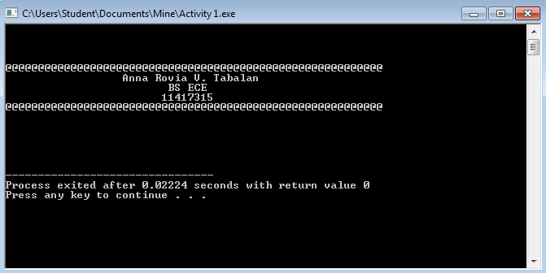
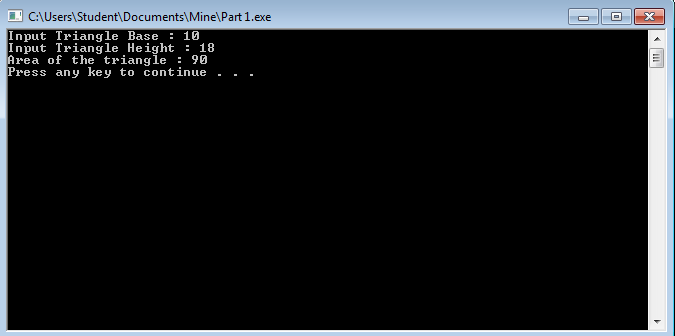
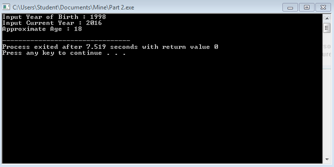
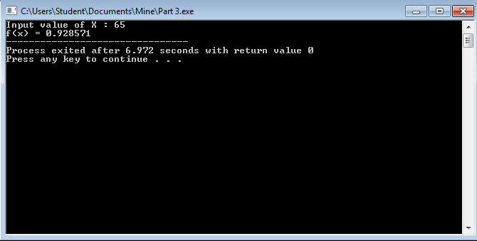

# Activity-1---Anna-Tabalan
```
#include <stdio.h>
#include <stdlib.h>

int main()
{
	printf ("\n\n\n\n@@@@@@@@@@@@@@@@@@@@@@@@@@@@@@@@@@@@@@@@@@@@@@@@@@@@@@@@@@\n");
	printf("\t\t  Anna Rovia V. Tabalan\n");
	printf("\t\t\t BS ECE\n");
	printf("\t\t\t11417315\n");
	printf ("@@@@@@@@@@@@@@@@@@@@@@@@@@@@@@@@@@@@@@@@@@@@@@@@@@@@@@@@@@\n\n\n\n\n\n");
}
```


```
#include <stdio.h>
#include <stdlib.h>

int main () {
	int base, height,area;
	printf ("Input Triangle Base : ");
	scanf("%d",&base);
	printf ("Input Triangle Height : ");
	scanf("%d",&height);
	area = (base*height)/2;
	printf("Area of the triangle : %d\n",area);
	system("PAUSE");
}
```


```
#include <stdio.h>
#include <stdlib.h>

int main () {
	int yr1,yr2,age;
	printf("Input Year of Birth : ");
	scanf("%d",&yr1);
	printf("Input Current Year : ");
	scanf("%d",&yr2);
	age = yr2-yr1;
	printf("Approximate Age : %d\n",age);
}
```


```
#include <stdio.h>
#include <stdlib.h>

int main () { 
	float x,y;
	printf("Input value of X : ");
	scanf("%f",&x);
	y = x/70;
	printf("f(x) = %f",y);
}
```

